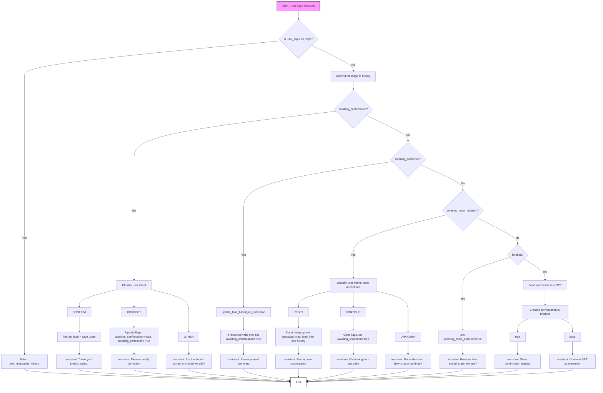

# Flowchart for marketing_ai_ajent.py

This flowchart reflects the logic of the `marketing_ai_ajent.py` file in the `MarketingAjent` class, describing the `process_conversational_lead` function. It includes exact variable names and brief explanations for each node.

